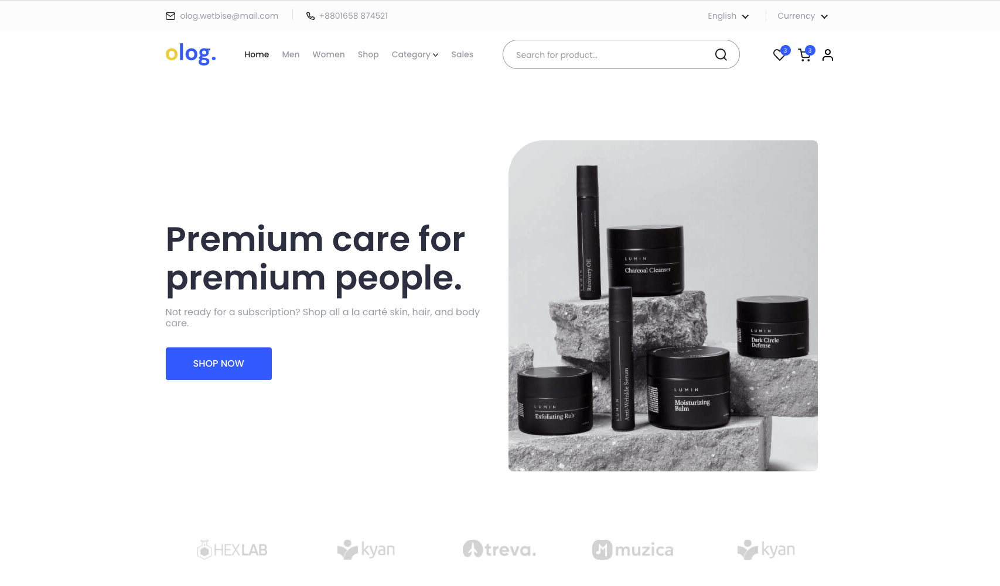

# [Echotemplate.com](https://echotemplate.com)
FREE UI & HTML Templates for Designer and Developer. Echotemplate is a place where a team of design & developers create beautiful templates. Visit [Echotemplate.com](https://echotemplate.com) for more updates.

# [Olog eCommerce Responsive HTML Template](https://echotemplate.com)

> Olog eCommerce Responsive HTML Template based on bootstrap framework v4.5.

This project is a bootstrap version [Olog eCommerce Responsive HTML Template](https://www.echotemplate.com/templates/olog-ecommerce-responsive-html-template) designed with HTML, CSS, SCSS, Bootstrap, Javascript & Jquery.

Check the [Live Demo here](https://demo.echotemplate.com/olog-ecommerce-responsive-html-template).

## Technology We used
- HTML 5
- CSS 3
- SCSS 
- Bootstrap
- Fontawesome Icons 
- Javascript & jQuery
- Webpack 4
- Autoprefixer 

## Credits
- Design by coded by [Zakir Soft](https://zakirsoft.com)
- Fonts by Google Fonts - [Poppins](https://fonts.google.com/specimen/Poppins)
- Images from [Unsplash.com](http://unsplash.com)
- SVG Icons from [Feather Icons](https://feathericons.com)

## License
The MIT License (MIT). Please see [License File](LICENSE.md) for more information.

# Webpack Boilerplate
This repository contains Webpack and SCSS boilerplate code to quickly get started on building a webpage following a simplified version of SASS (7-1 pattern).

## Project Setup
### Installing
Run `npm install` to install all the dependencies this project needs. 

### Running the app
Run `npm run dev`. Your browser should automatically open a new tab where you can see your app.
*Note :* live reload is enabled so just modify your files and it will be reflected on the app instantly.

### Building the app
Run `npm run build`. It will automatically add vendor prefixes to CSS rules and compress all your `.scss` files into one `style.css` file located in your `dist` folder.

## SASS folder structure
It contains these folder and files : 

- `abstracts` : functions, variables
- `base` : reset, typography,
- `components` : buttons, form
- `layout` : footer, header, nav, breadcrumb
- `pages` : contact, home,
- `themes` : theme
- `vendors` : bootstrap, fontawesome

## Included Framework and Libraries
- `fontawesome` - Font Library

## Webpack Dependencies
- Webpack
- Babel
- File Loader
- CSS Loader
- Node SASS
- SASS Loader
- Post CSS 
- Autoprefixer
- Purge CSS
- Mini CSS Extractor Plugin

